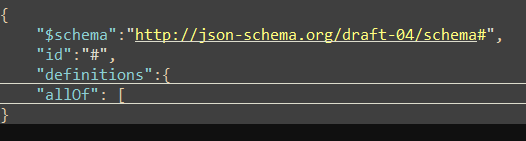

# Modify Json Schemas

## Description
I was looking for a way to generate json schema's from xsd files. After checking out a few projects and generators 
I found online, I ended up with the [Jsonix Schema Compiler](https://github.com/highsource/jsonix-schema-compiler)
This was the closes match I found, but with a couple  of sidenotes.

 - It uses Jsonix schema definitions instead of plain json definitions.  

 - Generates a more complex local type structure 

 - No default json schema is added  

 - The closing anyOff selector is not applicable for my case and more complex then should be 

It does generate and inline all xsd dependencies, which is a nice touch. 

## Details
In order to make the generated jsonix schemas usable, I needed to do some small changes
 - Replace jsonix schema definitions with plain json schema definitions 

 - Replace the final anyOff selector with a proper allOf selector 

 - Add default json schema to the beginning of the file 

## Usage
After running the jsonix compiler (more info on cli can be found on [github](https://github.com/highsource/jsonix-schema-compiler/wiki/Command-Line-Usage))
You run the UpdateJsonSchema code:

`#java -jar .\ModifyJsonSchema.jar [input file path] [Json schema object]` 
`java -jar .\ModifyJsonSchema.jar C:\Matthias\jsonschema\VisitTruck.jsonix.schema.json VisitTruck` 

A file is generated under "[inputFolder]\generated\" with the name "[json schema object].schema.json"

## Resources 
[Jsonix schema compiler - GitHub home](https://github.com/highsource/jsonix-schema-compiler)

[Jsonix command line](https://github.com/highsource/jsonix-schema-compiler/wiki/Command-Line-Usage)

[Json Schema faker - Generate json files from a json schema](https://json-schema-faker.js.org/)

